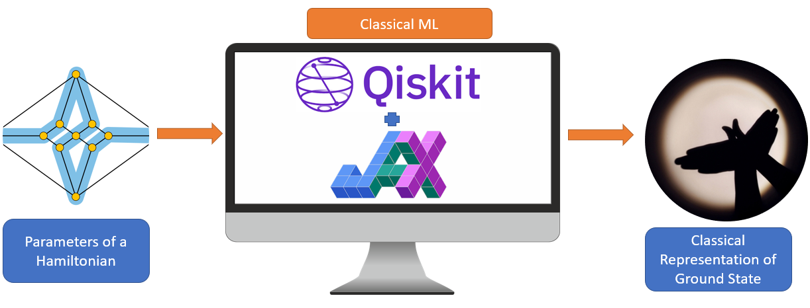

## Open in Codespaces [New Feature :sparkles:]

The project aims to predict ground state properties of exotic quantum states of matter at the phase transition boundaries using machine learning.   

**Current Update:** A Two-Qubit Hamiltonian was constructed representing H2-molecule at its equilibrium distance. The ground state energy was obtained by both diagonalizing the matrix and also by the VQE experiment. Classical shadows were then obtained by consecutively applying random unitaries and then measuring them in X, Y and Z bases. The machine learning model given in https://arxiv.org/abs/2106.12627 was analyzed to ensure compatibility with the current experiment and has been modified to train the classical shadows obtained from the two qubit hydrogen hamiltonian.   

**Next Steps:** Identifying a sophisticated hamiltonian, training the machine leanring algorithm with the classical shadows of the hamiltonian and finally predicting the ground state properties at the phase transition boundaries. 

### Project Workflow  

